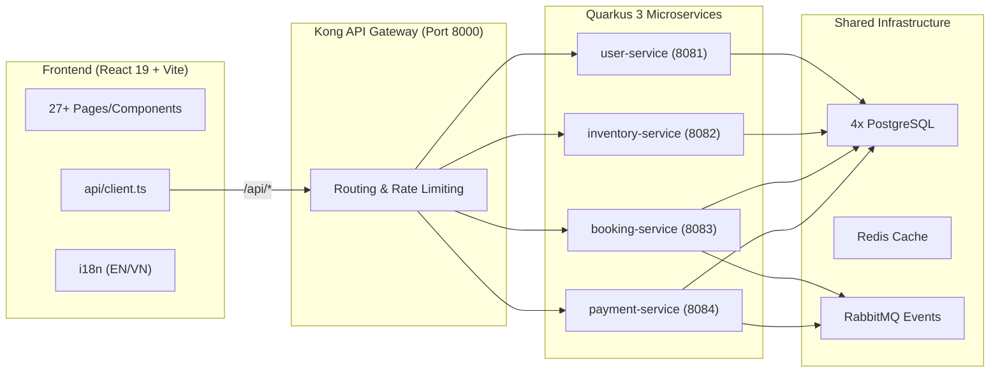

<a id="readme-top"></a>

<!-- PROJECT HEADER -->
<br />
<div align="center">
  <h3 align="center">Lumière Estate Hotel Management SaaS</h3>

  <!-- PROJECT SHIELDS -->
  <p align="center">
    <a href="https://github.com/sniknerduke/HotelManagementSaaS/graphs/contributors">
      
    </a>
    <a href="https://github.com/sniknerduke/HotelManagementSaaS/network/members">
      
    </a>
    <a href="https://github.com/sniknerduke/HotelManagementSaaS/stargazers">
      
    </a>
    <a href="https://github.com/sniknerduke/HotelManagementSaaS/issues">
      
    </a>
    <a href="https://github.com/sniknerduke/HotelManagementSaaS/blob/main/LICENSE">
      
    </a>
  </p>

  <p align="center">
    Full-stack hotel booking and management platform built with a React 19 + TypeScript frontend and a Quarkus 3 + Java 21 microservice backend.
    <br />
    <a href="https://github.com/sniknerduke/HotelManagementSaaS"><strong>Explore the docs &raquo;</strong></a>
    <br />
    <br />
    <a href="https://sniknerduke.dev">View Demo</a>
    &middot;
    <a href="https://github.com/sniknerduke/HotelManagementSaaS/issues/new?labels=bug"><strong>Report Bug</strong></a>
    &middot;
    <a href="https://github.com/sniknerduke/HotelManagementSaaS/issues/new?labels=enhancement"><strong>Request Feature</strong></a>
  </p>
</div>


<details>
  <summary>Table of Contents</summary>
  <ol>
    <li>
      <a href="#about-the-project">About The Project</a>
      <ul>
        <li><a href="#highlights">Highlights</a></li>
        <li><a href="#built-with">Built With</a></li>
        <li><a href="#architecture">Architecture</a></li>
      </ul>
    </li>
    <li>
      <a href="#getting-started">Getting Started</a>
      <ul>
        <li><a href="#prerequisites">Prerequisites</a></li>
        <li><a href="#installation">Installation</a></li>
      </ul>
    </li>
    <li><a href="#usage">Usage</a></li>
    <li><a href="#frontend-routes">Frontend Routes</a></li>
    <li><a href="#backend-services">Backend Services</a></li>
    <li><a href="#project-structure">Project Structure</a></li>
    <li><a href="#current-notes">Current Notes</a></li>
    <li><a href="#roadmap">Roadmap</a></li>
    <li><a href="#contributing">Contributing</a></li>
    <li><a href="#license">License</a></li>
    <li><a href="#contact">Contact</a></li>
    <li><a href="#acknowledgments">Acknowledgments</a></li>
  </ol>
</details>


## About The Project

**Lumiere Estate Hotel Management SaaS** is a connected hotel booking and operations platform. The frontend communicates with the backend through a centralized fetch client and the Kong API gateway, so the application runs as a real integrated system rather than a mock-only prototype.

The platform supports the full guest journey, account management, staff operations, administration workflows, payments, and localization for English and Vietnamese users.

<p align="right"><a href="#readme-top">🔼</a></p>


### Highlights

* **Guest Journey**: Hero search, dynamic room results, detailed listings, and a 3-step checkout flow.
* **Integrated Payments**: Full VNPay sandbox integration with secure callback handling and event-driven booking confirmation.
* **Microservice Auth**: JWT-based security with bcrypt hashing and integrated Google/Facebook OAuth2 flows.
* **Luxury UI**: Framer Motion animations, immersive splash screen, AI-powered concierge chatbot, and Tailwind CSS v4 styling.
* **Operations Portals**: Dedicated, role-based dashboards for **Staff** (housekeeping, occupancy) and **Admins** (CRM, revenue analytics, inventory).
* **Localization**: Complete support for English (EN) and Vietnamese (VI) throughout the application.
* **Robust Infrastructure**: Dynamic amenity management, OTP-based password reset, and event-driven architecture via RabbitMQ.

<p align="right"><a href="#readme-top">🔼</a></p>


### Built With

* [![React][React.js]][React-url]
* [![TypeScript][TypeScript]][TypeScript-url]
* [![Vite][Vite]][Vite-url]
* [![Quarkus][Quarkus]][Quarkus-url]
* [![Java][Java]][Java-url]
* [![PostgreSQL][PostgreSQL]][PostgreSQL-url]
* [![Redis][Redis]][Redis-url]
* [![RabbitMQ][RabbitMQ]][RabbitMQ-url]
* [![Kong][Kong]][Kong-url]
* [![Docker][Docker]][Docker-url]

The frontend also uses Tailwind CSS v4, React Router, i18next/react-i18next, Framer Motion, Lucide React, Recharts, jsPDF, and jsPDF-AutoTable for styling, navigation, localization, motion, charts, and reporting.

<p align="right"><a href="#readme-top">🔼</a></p>


### Architecture

The system follows a microservices architecture coordinated through the **Kong API Gateway**.



In development, Vite proxies `/api` to Kong. Kong routes requests to the appropriate services:

| Gateway Path | Service | Base Paths |
| --- | --- | --- |
| `/api/users`, `/api/auth` | `user-service` | Auth, Profile, OAuth, CRM |
| `/api/inventory`, `/api/settings`, `/api/housekeeping` | `inventory-service` | Rooms, Availability, Amenities |
| `/api/bookings`, `/api/promotions`, `/api/analytics` | `booking-service` | Reservations, Discounts, Analytics |
| `/api/payments` | `payment-service` | Payments, VNPay, Receipts |

Shared infrastructure in the Docker stack includes PostgreSQL, Redis, RabbitMQ, and Kong.

<p align="right"><a href="#readme-top">🔼</a></p>


## Getting Started

Follow the steps below to run the frontend, backend services, or full Docker stack locally.

### Prerequisites

Make sure the following tools are installed:

* Node.js and npm
* Java 21
* Maven or the included Maven wrapper
* Docker and Docker Compose

### Installation

1. Clone the repo
   ```sh
   git clone https://github.com/sniknerduke/HotelManagementSaaS.git
   ```
2. Navigate into the project
   ```sh
   cd HotelManagementSaaS
   ```
3. Install frontend dependencies
   ```sh
   npm install
   ```
4. Start the frontend
   ```sh
   npm run dev
   ```
5. Open the app at `http://localhost:5173`.

<p align="right">(<a href="#readme-top">back to top</a>)</p>


<!-- USAGE EXAMPLES -->
## Usage

### Frontend

From the project root:

```sh
npm install
npm run dev
```

The frontend runs on:

```text
http://localhost:5173
```

### Backend Services

From `backend/`, run each service in a separate terminal:

```sh
# Terminal 1
.\mvnw.cmd -pl user-service quarkus:dev

# Terminal 2
.\mvnw.cmd -pl inventory-service quarkus:dev

# Terminal 3
.\mvnw.cmd -pl booking-service quarkus:dev

# Terminal 4
.\mvnw.cmd -pl payment-service quarkus:dev
```

### Docker Stack

Start the full local stack from `backend/`:

```sh
docker-compose up -d --build
```

This starts the four backend services, four PostgreSQL databases, Kong, Redis, and RabbitMQ.

For the production compose file, use:

```sh
docker-compose -f docker-compose.prod.yml up -d --build
```

If you use the production stack, set the required environment variables for database credentials, JWT keys, SMTP, VNPay, and frontend/API URLs.

### Optional Build Commands

Frontend:

```sh
npm run build
npm run preview
```

Backend:

```sh
.\mvnw.cmd clean install
```

<p align="right">(<a href="#readme-top">back to top</a>)</p>


## Frontend Routes

| Route | Purpose |
| --- | --- |
| `/` | Home |
| `/search` | Search results |
| `/room/:id` | Room detail |
| `/amenities` | Amenities |
| `/contact` | Contact |
| `/experiences` | Experiences |
| `/faq` | FAQ |
| `/privacy` | Privacy Policy |
| `/terms` | Terms of Service |
| `/login` | Login |
| `/register` | Register |
| `/oauth/callback` | Social auth callback |
| `/checkout` | Checkout flow |
| `/payment/success` | VNPay success callback |
| `/payment/failed` | VNPay failure callback |
| `/dashboard` | Guest dashboard |
| `/profile` | Guest profile |
| `/staff` | Staff portal |
| `/admin` | Admin dashboard |

> `/dashboard` is the guest dashboard; staff access lives on `/staff`.

<p align="right">(<a href="#readme-top">back to top</a>)</p>


## Backend Services

Backend root: `backend/`

| Service | Port | Base paths | Notes |
| --- | --- | --- | --- |
| `user-service` | 8081 | `/api/users`, `/api/auth` | Registration, login, OAuth, profile, password reset, CRM, roles |
| `inventory-service` | 8082 | `/api/inventory`, `/api/settings`, `/api/housekeeping` | Rooms, room types, availability, amenities, housekeeping, settings |
| `booking-service` | 8083 | `/api/bookings`, `/api/promotions`, `/api/analytics` | Reservations, booking lifecycle, promotions, analytics |
| `payment-service` | 8084 | `/api/payments` | Payments, refunds, VNPay integration, payment events |

The backend is a Maven multi-module project with Quarkus DevServices configured for local PostgreSQL startup when running services individually.

<p align="right">(<a href="#readme-top">back to top</a>)</p>


## Project Structure

```text
📁 Java NC BTL/                     ← Root
├── 📁 src/                         ← Frontend (React 19 + Vite)
│   ├── App.tsx                     ← Router & route definitions
│   ├── 📁 api/                     ← Centralized fetch client & service modules
│   ├── 📁 components/              ← UI primitives & layout elements
│   ├── 📁 context/                 ← In-memory auth state & toast notifications
│   ├── 📁 pages/                   ← Guest, Admin, and Staff portal screens
│   └── 📁 locales/                 ← i18next bundles (en/vi)
│
├── 📁 backend/                     ← Backend (Quarkus Multi-Module Maven)
│   ├── 📁 kong/                    ← Declarative API gateway config
│   ├── 📁 user-service/            ← Registration, login, OAuth, profile
│   ├── 📁 inventory-service/       ← Rooms, availability, amenities, housekeeping
│   ├── 📁 booking-service/         ← Reservations, booking lifecycle, analytics
│   ├── 📁 payment-service/         ← Payments, refunds, VNPay integration
│   └── docker-compose.yml          ← Local infrastructure stack
└── README.md                       ← Project documentation
```

<p align="right">(<a href="#readme-top">back to top</a>)</p>


## Current Notes

* The frontend API layer is implemented in `src/api/client.ts` and `src/api/index.ts`.
* Auth uses bcrypt + JWT, and social login routes hit `/api/auth/google` and `/api/auth/facebook`.
* Booking and payment flows coordinate through service-to-service REST clients and RabbitMQ events.
* Dev traffic goes through Kong on port `8000`; the UI proxy points `/api` there.

<p align="right">(<a href="#readme-top">back to top</a>)</p>


<!-- CONTRIBUTING -->
## Contributing

Contributions are what make the open source community such an amazing place to learn, inspire, and create. Any contributions you make are **greatly appreciated**.

If you have a suggestion that would make this better, please fork the repo and create a pull request. You can also open an issue with the tag `enhancement`.

1. Fork the Project
2. Create your Feature Branch (`git checkout -b feature/AmazingFeature`)
3. Commit your Changes (`git commit -m 'Add some AmazingFeature'`)
4. Push to the Branch (`git push origin feature/AmazingFeature`)
5. Open a Pull Request

<p align="right">(<a href="#readme-top">back to top</a>)</p>

### Top contributors:

<a href="https://github.com/sniknerduke/HotelManagementSaaS/graphs/contributors">
  
</a>


<!-- LICENSE -->
## License

A license file has not been added yet.

<p align="right">(<a href="#readme-top">back to top</a>)</p>


<!-- CONTACT -->
## Contact

Project Link: [https://github.com/sniknerduke/HotelManagementSaaS](https://github.com/sniknerduke/HotelManagementSaaS)

Live Demo: [https://sniknerduke.dev](https://sniknerduke.dev)

<p align="right">(<a href="#readme-top">back to top</a>)</p>


<!-- ACKNOWLEDGMENTS -->
## Acknowledgments

* React, TypeScript, Vite, Quarkus, and Java communities
* Kong, PostgreSQL, Redis, RabbitMQ, and Docker documentation
* VNPay integration resources

<p align="right">(<a href="#readme-top">back to top</a>)</p>


<!-- MARKDOWN LINKS & IMAGES -->
[contributors-shield]: https://img.shields.io/github/contributors/sniknerduke/HotelManagementSaaS.svg?style=for-the-badge
[contributors-url]: https://github.com/sniknerduke/HotelManagementSaaS/graphs/contributors
[forks-shield]: https://img.shields.io/github/forks/sniknerduke/HotelManagementSaaS.svg?style=for-the-badge
[forks-url]: https://github.com/sniknerduke/HotelManagementSaaS/network/members
[stars-shield]: https://img.shields.io/github/stars/sniknerduke/HotelManagementSaaS.svg?style=for-the-badge
[stars-url]: https://github.com/sniknerduke/HotelManagementSaaS/stargazers
[issues-shield]: https://img.shields.io/github/issues/sniknerduke/HotelManagementSaaS.svg?style=for-the-badge
[issues-url]: https://github.com/sniknerduke/HotelManagementSaaS/issues
[license-shield]: https://img.shields.io/github/license/sniknerduke/HotelManagementSaaS.svg?style=for-the-badge
[license-url]: https://github.com/sniknerduke/HotelManagementSaaS#license

[React.js]: https://img.shields.io/badge/React_19-20232A?style=for-the-badge&logo=react&logoColor=61DAFB
[React-url]: https://react.dev/
[TypeScript]: https://img.shields.io/badge/TypeScript-3178C6?style=for-the-badge&logo=typescript&logoColor=white
[TypeScript-url]: https://www.typescriptlang.org/
[Vite]: https://img.shields.io/badge/Vite-646CFF?style=for-the-badge&logo=vite&logoColor=white
[Vite-url]: https://vite.dev/
[Quarkus]: https://img.shields.io/badge/Quarkus_3-4695EB?style=for-the-badge&logo=quarkus&logoColor=white
[Quarkus-url]: https://quarkus.io/
[Java]: https://img.shields.io/badge/Java_21-ED8B00?style=for-the-badge&logo=openjdk&logoColor=white
[Java-url]: https://openjdk.org/projects/jdk/21/
[PostgreSQL]: https://img.shields.io/badge/PostgreSQL-4169E1?style=for-the-badge&logo=postgresql&logoColor=white
[PostgreSQL-url]: https://www.postgresql.org/
[Redis]: https://img.shields.io/badge/Redis-DC382D?style=for-the-badge&logo=redis&logoColor=white
[Redis-url]: https://redis.io/
[RabbitMQ]: https://img.shields.io/badge/RabbitMQ-FF6600?style=for-the-badge&logo=rabbitmq&logoColor=white
[RabbitMQ-url]: https://www.rabbitmq.com/
[Kong]: https://img.shields.io/badge/Kong-003459?style=for-the-badge&logo=kong&logoColor=white
[Kong-url]: https://konghq.com/
[Docker]: https://img.shields.io/badge/Docker-2496ED?style=for-the-badge&logo=docker&logoColor=white
[Docker-url]: https://www.docker.com/
