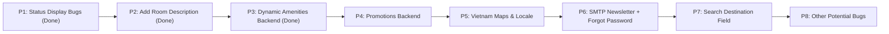

# Lumière Hotel SaaS — Bug Fixes & Feature Plan

> **Goal**: Fix existing bugs, add missing features, and improve data consistency across the hotel management platform.

---

## Proposed Priority Order

---

## P3 — Dynamic Amenities Management (DONE)

- Created new `Amenity` entity and `AmenityResource`.
- Updated `Room` and `RoomType` to use `@ManyToMany List<Amenity>`.
- Admin Dashboard updated to manage amenities globally and use dynamic checkboxes.
- Search page filters dynamically based on backend amenities.

---

## P4 — Promotion/Coupon Backend Persistence

> Currently, the admin dashboard has a mocked list of coupons. We need to persist this in the database and tie it to the checkout flow.

1. **[NEW] `Promotion.java`**: Create entity (`code`, `discountPercentage`, `active`).
2. **[NEW] `PromotionResource.java`**: Add API to manage and validate promotions.
3. **[MODIFY] `AdminDashboard.tsx`**: Replace the static `coupons` state with API calls to `PromotionResource`.
4. **[MODIFY] `Checkout.tsx`**: Validate the entered coupon against the backend and apply the discount before triggering VNPay.

---

## P5 — Vietnam Maps & Location Info (Completed)

> Replaced generic placeholders with District 1, Ho Chi Minh City, Vietnam.

1. **[MODIFY] `Home.tsx` & `Contact.tsx`**: Update the Map coordinates and iframe to point to District 1, Ho Chi Minh City, Vietnam.
2. **[MODIFY] `SearchResults.tsx`**: Update the map coordinates shown next to the search results.
3. **[MODIFY] Text/Locales**: Update any references of generic locations to Ho Chi Minh City.

---

## P6 — SMTP Newsletter & Forgot Password

> Currently, newsletter signups and forgot password forms do nothing.

1. **[MODIFY] `user-service` POM**: Add `quarkus-mailer` extension.
2. **[NEW] `MailService.java`**: Create a service to handle sending emails using Mailtrap or Gmail SMTP.
3. **[MODIFY] `UserResource.java`**: Add `/forgot-password` and `/newsletter-signup` endpoints.
4. **[MODIFY] Frontend Forms**: Hook up the newsletter form in the Footer and the Forgot Password modal to these endpoints.

---

## P7 — Search Destination Field

> The search bar has a "Destination" input, but since this is a single hotel app, it is confusing.

1. **[MODIFY] Search Bar Components**: Remove the destination input completely and adjust the layout.
2. **[MODIFY] Context/State**: Remove references to destination string.

---

## P8 — Other Potential Bugs Found During Research

- Check if `PaymentResource` is properly handling concurrent checkout states.
- Ensure room availability strictly blocks double-booking for the exact same dates.
- Audit React `useEffect` hooks for infinite rendering loops.
